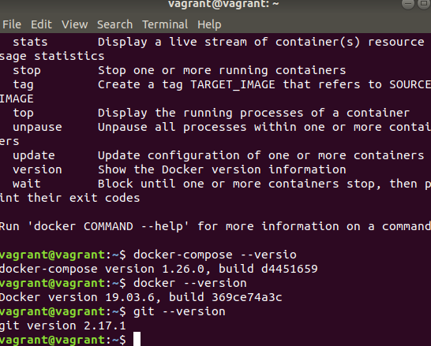

## Creating Ova Files using the Packer

Download and Install the **Packer** tool using the given [link](https://www.packer.io/downloads)

Download and Install **Virtualbox** using the given [link](https://www.virtualbox.org/manual/ch02.html)

## Installation Steps

Clone the Repo

``` bash
git clone https://github.com/filetrust/k8-ova.git
```

Move into the `packer` Directory

``` bash
cd k8-ova/packer
```

Build the Image

``` bash
packer build box.json
```

After Sucessfull Installation

Import the OVA file by going into the `output-virtualbox-iso` and Import the Image by **Double** clicking the ova file 

```
username:vagrant
password:vagrant
```

### Tools Installed

- Git
- Docker
- docker-compose

### Todo

- Clonning the Repo
- Installing the Script

